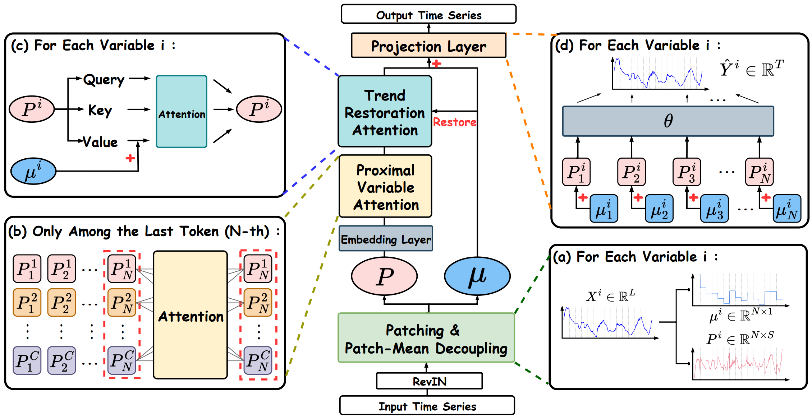
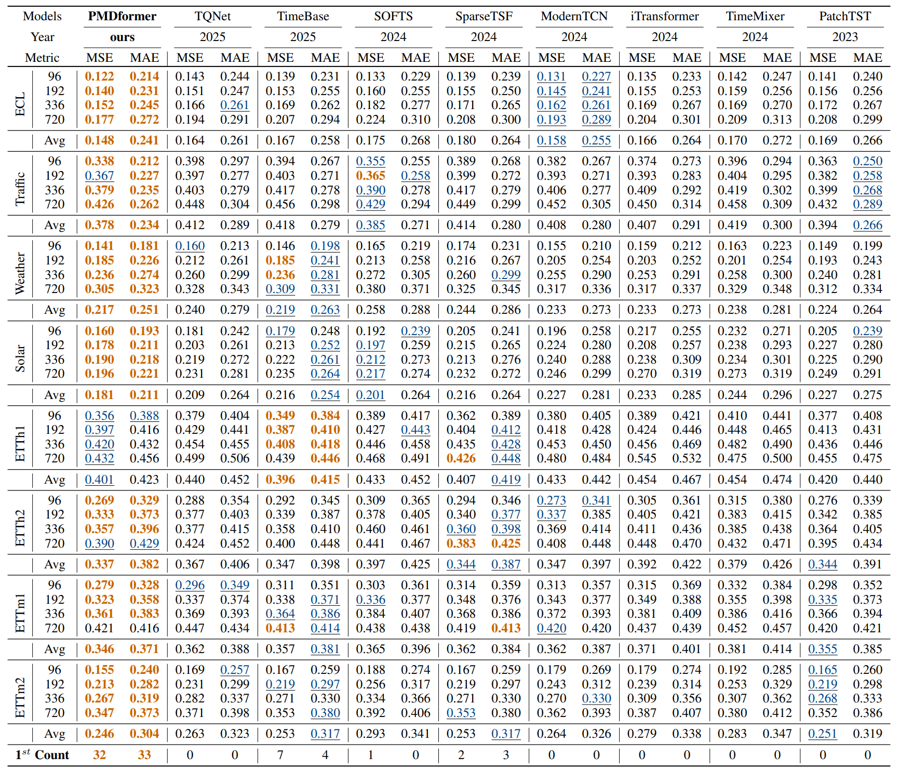

# PMDFormer：面向长期预测的Patch均值解耦信息Transformer

[](https://openreview.net/forum?id=rfJ41gK9Ct)
[](https://www.python.org/)
[](https://pytorch.org/)

**[English](README.md) | 中文**

## 模型简介

PMDFormer 针对时序预测中 Patch 尺度差异导致注意力偏差的问题，提出了三个核心模块：**Patch 均值解耦（PMD）** 通过减去每个 Patch 的均值，将长程趋势与局部形状信息显式分离，使注意力机制更专注于捕捉 Patch 间真实的形状相似性；**近端变量注意力（PVA）** 仅在距预测点最近的 Patch 上建模跨变量依赖，避免引入历史噪声；**趋势恢复注意力（TRA）** 将解耦出的均值重新注入注意力的 Value 路径，在保留形状匹配能力的同时恢复全局趋势建模。

## 模型架构



## 主要实验结果



## 快速开始

### 1. 安装依赖

```bash
pip install -r requirements.txt
```

### 2. 下载数据集

从 📦 **[Google Drive](https://drive.google.com/drive/folders/13Cg1KYOlzM5C7K8gK8NfC-F3EYxkM3D2?usp=sharing)** 下载数据集，放置在与本仓库**平行**的 `../dataset/` 目录下：

```
├── PMDformer/
└── dataset/
    ├── ETT-small/      # ETTh1, ETTh2, ETTm1, ETTm2
    ├── weather/
    ├── electricity/
    ├── traffic/
    └── Solar/
```

### 3. 训练模型

```bash
# 一次性运行所有数据集
bash scripts/all.sh

# 或单独运行某个数据集，例如：
bash scripts/PMDformer/etth1.sh
bash scripts/PMDformer/solar.sh
```

训练日志和模型权重默认保存在 `./checkpoints/` 目录下。

## 引用

如果本工作对您有帮助，请引用我们的论文：

```bibtex
@inproceedings{
hu2026pmdformer,
title={{PMD}former: Patch-Mean Decoupling Transformer for Long-term Forecasting},
author={Ao Hu and Liangjian Wen and Jiang Duan and Yong Dai and Dongkai Wang and Jun Wang and YAN HE and Yukun Zhang and Ruoxi Jiang and Zenglin Xu},
booktitle={The Fourteenth International Conference on Learning Representations},
year={2026},
url={https://openreview.net/forum?id=rfJ41gK9Ct}
}
```